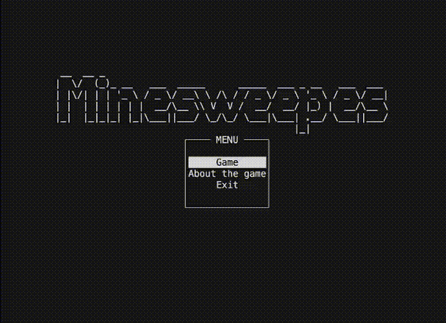

# Minesweeper game

## Description of the project.

This project is a miner game that includes source code, build automation scripts. This makes it easy to install and play the game. 

## Software dependencies.

* C++14
* Make 4.4.1
* libncurses5-dev 
* pkg-config

## Example

       

 

## Authors
pbalykov - developer [github](https://github.com/pbalykov)
